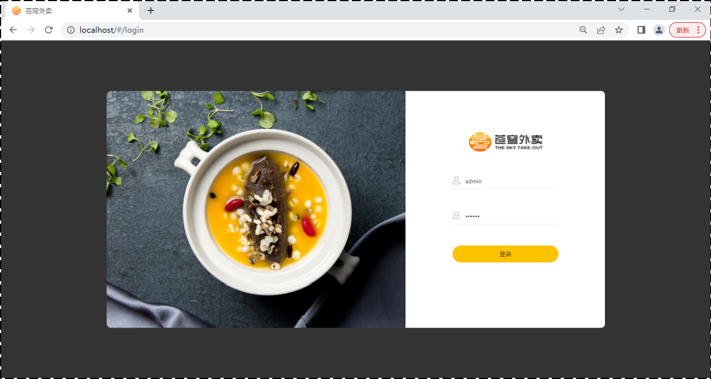
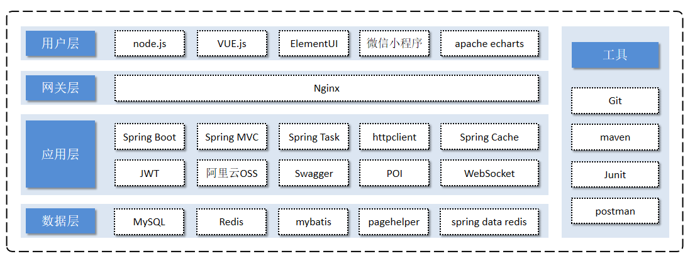

# SkyTakeout

## 1. Project Introduction

This project, named "SkyTakeout," is a software product specifically tailored for the catering industry (restaurants and hotels). It is developed based on the Spring Boot framework and related technologies, comprising both the ==System Management Backend== and ==Mini Program Application==.

- The System Management Backend is primarily intended for internal use by employees of catering enterprises. It allows the management and maintenance of restaurant categories, dishes, combos, orders, and staff. It also provides statistical analysis of various data related to the restaurant and includes a voice announcement feature for incoming orders.

- The Mini Program Application is designed for consumer use, providing features such as online browsing of menu items, adding items to the shopping cart, placing orders, making payments, and order tracking.

Login Interface

Data Statistics Interface

WeChat Mini Program Interface

- **1). Management-side Features**

    - Employee login/logout, employee information management, category management, dish management, combo management, dish flavor management, order management, data statistics, and incoming order alerts.

  **2). User-side Features**

    - WeChat login, recipient address management, user order history inquiry, dish specification inquiry, shopping cart functionality, order placement, payment, and category and dish browsing.

## Technology Stack

In terms of technology selection for this project, we will introduce the choices made in terms of the User Layer, Gateway Layer, Application Layer, and Data Layer, showcasing the frameworks and middleware used in the project.

**1). User Layer**

In building the frontend pages for the System Management Backend in this project, we will use technologies such as H5, Vue.js, ElementUI, and Apache Echarts for chart display. For the construction of the mobile application, we will use the WeChat Mini Program.

**2). Gateway Layer**

Nginx serves as a server primarily for HTTP, deploying static resources and ensuring high accessibility. Nginx also plays crucial roles in reverse proxy and load balancing. During project deployment, Nginx can be employed to achieve load balancing for Tomcat.

**3). Application Layer**

- **Spring Boot**: Rapid construction of Spring projects, following the "convention over configuration" philosophy, simplifying Spring project configuration and development.

- **Spring MVC**: A module of the Spring framework, seamlessly integrated with Spring without requiring an intermediate integration layer.

- **Spring Task**: A scheduling framework provided by Spring.

- **HTTP Client**: Implementation of sending HTTP requests.

- **Spring Cache**: A data caching framework provided by Spring.

- **JWT**: Used for authentication of users in the application.

- **Alibaba Cloud OSS**: Object Storage Service, primarily used for storing files such as images in the project.

- **Swagger**: Automatically generates interface documentation for developers and facilitates interface testing.

- **POI**: Encapsulates common operations on Excel spreadsheets.

- **WebSocket**: A communication protocol simplifying data exchange between client and server, employed for the implementation of order reception and order reminder features.

**4). Data Layer**

- **MySQL**: A relational database used to store core business data in this project.

- **Redis**: A memory database based on the key-value format, providing fast access and commonly used for caching.

- **MyBatis**: The persistence layer of this project will be developed using MyBatis.

- **Pagehelper**: A pagination plugin.

- **Spring Data Redis**: Simplifies Java code operations on the Redis API.

**5). Tools**

- **Git**: A version control tool used for managing project code in team collaboration.

- **Maven**: A project building tool.

- **JUnit**: A unit testing tool for testing functionalities once they are implemented by developers.

- **Postman**: An API testing tool, simulating various HTTP requests initiated by users and obtaining corresponding response results.